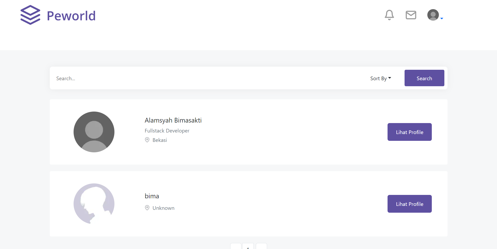

<div align="center">
  
</div>
<h3 align="center">Peworld Frontend</h3>
<p align="center">
  <a href="http://hirejob-snowy.vercel.app/">View Demo</a>
</p>

<!-- ABOUT THE PROJECT -->

## About The Project

Peworld Built up with NextJs with backend ExpressJS and deployment on Vercel.

### Technology Used

- [NextJS](https://nextjs.org/)
- [Redux](https://redux.js.org/)
- [Bootstrap](https://getbootstrap.com/)
- [Axios](https://github.com/axios/axios)

<!-- GETTING STARTED -->

## Getting Started

### Installation

- Clone This Repository

`git clone https://github.com/Massbim/hirejob`

- Install Module

`npm install`

- Setting .env

```bash
REACT_APP_API_BACKEND=YOUR_API_URL
```

### Executing program

- Run this project with `npm run start`.

<!-- SCREENSHOT -->

## Screenshot

### Login


### Home


### User List



### Edit Profile


<!-- CONTACT INFO -->

## Contact Info

Contributors names and contact info:

1. Alamsyah Bimasakti Qobus Nur Rahman

- [Linkedin](https://www.linkedin.com/in/alamsyahbimasakti)

## License

This project is licensed under the MIT License - see the LICENSE file for details
